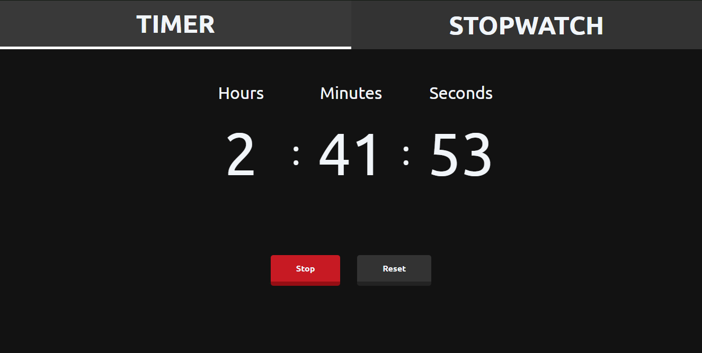
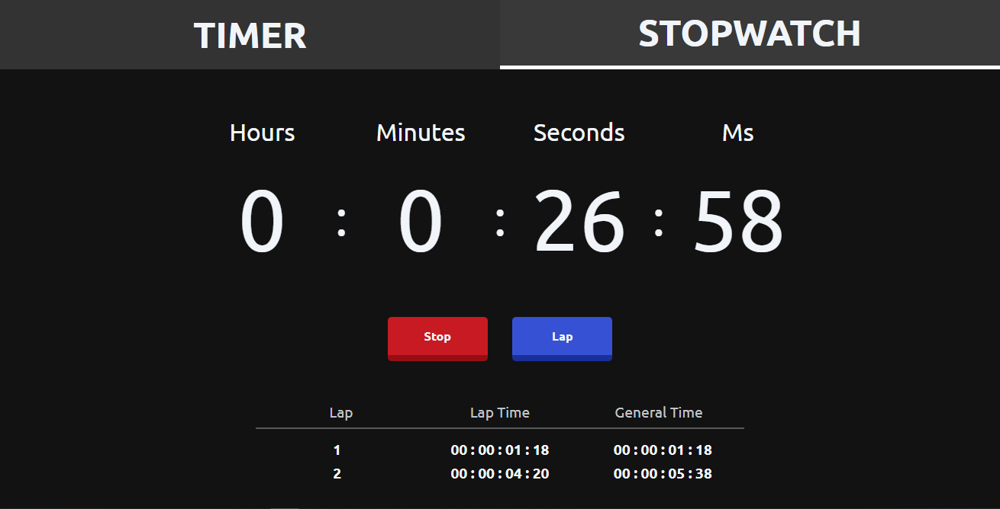

# Stopwatch Timer in React 
  

- This app was made to learn more about ReactJS and to think in a 'Reactive way'
- It was also made to practice styling with styled-components, which is a great library for organization

You can try it out at: https://stopwatch-timer-react.vercel.app

## Timer

  - Here you can set the hours / minutes / seconds
  - Then there is the start and reset buttons, where the start toggles between start/stop
  
  
  
  The responsive version is only shrinking some elements depending on the viewport width
  
  &nbsp;
  
## Stopwatch

  - Here you have all the basic functions of a stopwatch, which is having a button to start, stop, reset and register a lap
  - The start button toggles between start/stop, while the reset button toggles between reset/lap, where the second case only happens when the stopwatch is running

  
  
  The responsive version is only shrinking some elements depending on the viewport width
